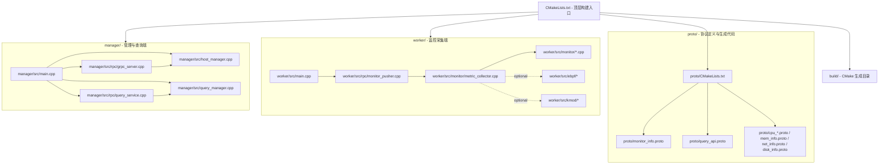
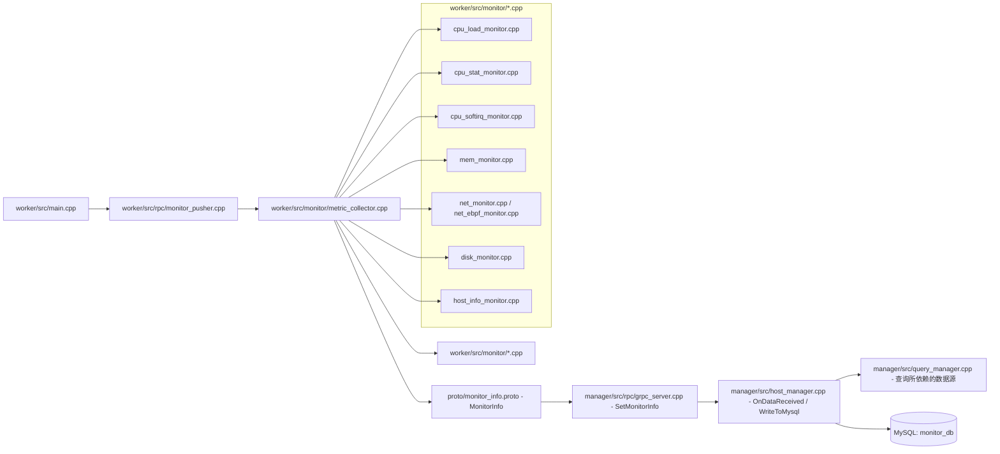
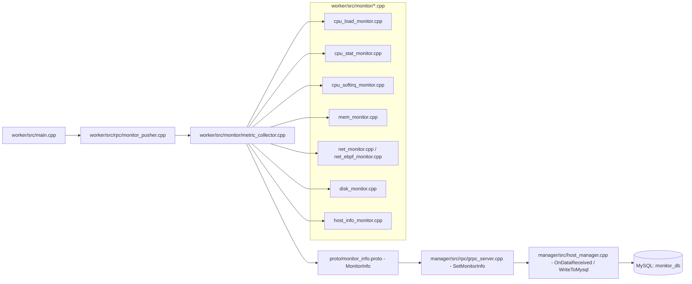
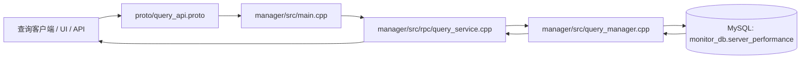
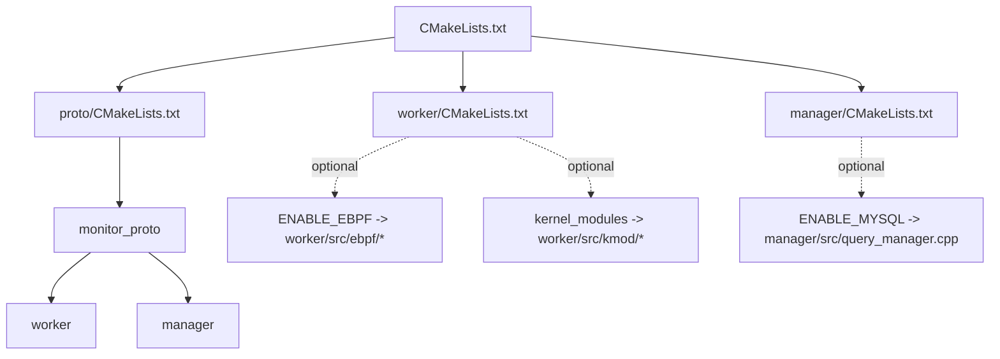

# monitor_system 项目结构与流程

`monitor_system` 是一个基于 C++、gRPC、MySQL、可选 eBPF/内核模块 的监控系统。默认链路是 Worker 主动采集并推送数据到 Manager，Manager 负责落库和查询；查询接口由 Manager 对外提供。

下面的图和说明会尽量把“哪个文件在处理哪一步”写清楚，便于按数据流阅读源码，而不是只看目录。

## 一、项目结构总览

- `CMakeLists.txt`：顶层构建入口，串起 `proto/`、`worker/`、`manager/`
- `proto/`：`.proto` 协议定义和生成代码
- `worker/`：监控采集端，负责采集指标并推送到 Manager
- `manager/`：管理端，负责接收数据、落库和查询
- `build/`：CMake 生成目录，不是源码

## 二、启动与运行主线

默认运行方式是：先启动 Manager，再启动 Worker。Manager 端会创建两个 gRPC 服务对象：一个接收 Worker 推送数据，另一个提供查询接口。

1. `manager/src/main.cpp` 启动 `GrpcServerImpl`、`HostManager`、`QueryManager` 和 `QueryServiceImpl`
2. `worker/src/main.cpp` 创建 `MonitorPusher`，按固定间隔循环推送 `MonitorInfo`
3. `worker/src/rpc/monitor_pusher.cpp` 通过 `MetricCollector` 获取一次完整采样，然后调用 gRPC `SetMonitorInfo`
4. `manager/src/rpc/grpc_server.cpp` 收到数据后先缓存，再回调 `HostManager::OnDataReceived`
5. `manager/src/host_manager.cpp` 计算评分、维护内存状态，并在启用 MySQL 时写入数据库

### 采集端内部怎么拆

`worker/src/monitor/metric_collector.cpp` 是采集编排中心，它把不同指标拆给不同实现文件：

- `worker/src/monitor/cpu_load_monitor.cpp`：CPU load
- `worker/src/monitor/cpu_stat_monitor.cpp`：CPU 使用率和细分时间片
- `worker/src/monitor/cpu_softirq_monitor.cpp`：软中断
- `worker/src/monitor/mem_monitor.cpp`：内存
- `worker/src/monitor/disk_monitor.cpp`：磁盘
- `worker/src/monitor/host_info_monitor.cpp`：主机信息
- `worker/src/monitor/net_monitor.cpp` 或 `worker/src/monitor/net_ebpf_monitor.cpp`：网络

`worker/src/main.cpp` 只负责启动和保持进程运行，真正的数据组装发生在 `monitor_pusher.cpp` -> `metric_collector.cpp` -> 各个 `monitor/*.cpp`。

## 三、推送数据的处理链路

这条链路是项目最核心的运行时数据流，数据是从 Worker 侧采集出来，经过 gRPC 推送到 Manager，再进入数据库。

这条链路里，`worker/src/rpc/monitor_pusher.cpp` 负责把所有采样包装成 `MonitorInfo`，`manager/src/rpc/grpc_server.cpp` 负责接住这个包，`manager/src/host_manager.cpp` 负责把包拆开并计算评分，`manager/src/query_manager.cpp` 则消费这些落库后的数据。

### 备用拉取接口

`worker/src/rpc/grpc_manager_impl.cpp` 里还有一个 `GetMonitorInfo` 实现，属于“管理端主动拉取”的保留接口。当前默认启动路径走的是 `worker/src/rpc/monitor_pusher.cpp` 的推送模式，所以这个文件更像备用实现，不是主链路。

## 四、查询数据的处理链路

查询链路和推送链路分离：查询是从 Manager 侧的 `QueryServiceImpl` 开始，最终由 `QueryManager` 访问数据库。

`manager/src/rpc/query_service.cpp` 负责把 gRPC 请求转换成 `QueryManager` 能处理的参数，然后把 `PerformanceRecord`、`AnomalyRecord`、`ServerScoreSummary`、`NetDetailRecord` 等结构再封装回 protobuf 响应。

## 五、构建关系

构建层面上，顶层 `CMakeLists.txt` 先生成 `monitor_proto`，再编译 `worker` 和 `manager` 两个可执行文件。

### 构建开关对应的代码位置

- `worker/CMakeLists.txt`：`ENABLE_EBPF` 控制是否启用 eBPF 网络采集
- `manager/CMakeLists.txt`：`ENABLE_MYSQL` 控制是否启用 MySQL 持久化和查询
- `proto/CMakeLists.txt`：生成 `monitor_info.proto` 和 `query_api.proto` 的 C++ 代码

## 六、建议的源码阅读顺序

如果你想按最短路径把项目读透，建议按下面顺序：

1. 先看 `proto/monitor_info.proto` 和 `proto/query_api.proto`
2. 再看 `worker/src/main.cpp`、`worker/src/rpc/monitor_pusher.cpp`、`worker/src/monitor/metric_collector.cpp`
3. 接着看 `manager/src/main.cpp`、`manager/src/rpc/grpc_server.cpp`、`manager/src/host_manager.cpp`
4. 最后看 `manager/src/query_manager.cpp` 和 `manager/src/rpc/query_service.cpp`
5. 如果需要更底层，再看 `worker/src/monitor/*.cpp`、`worker/src/ebpf/*`、`worker/src/kmod/*`

这样读下来，项目的数据路径会比较清楚：**采集 -> 封装 -> 推送 -> 接收 -> 落库 -> 查询**。
